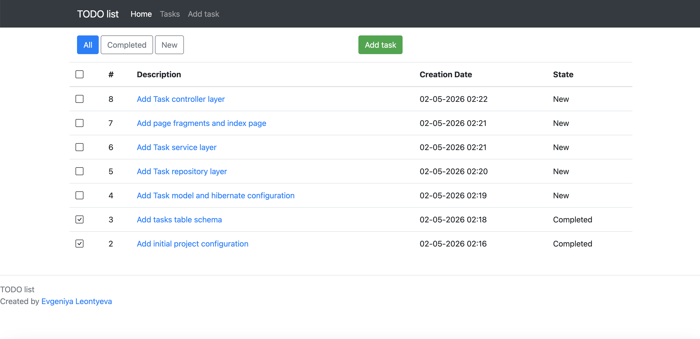
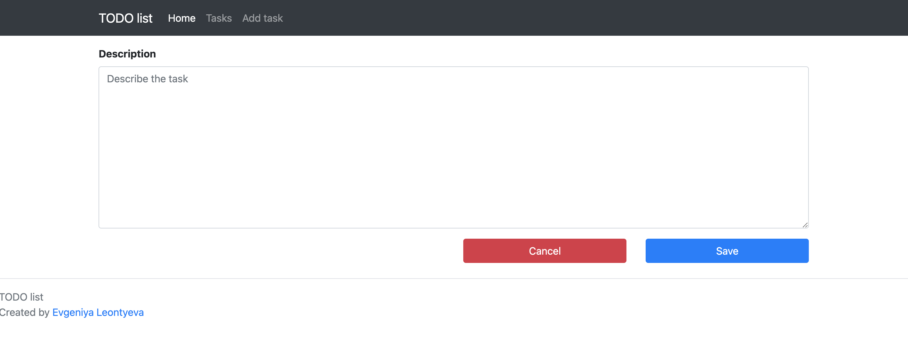
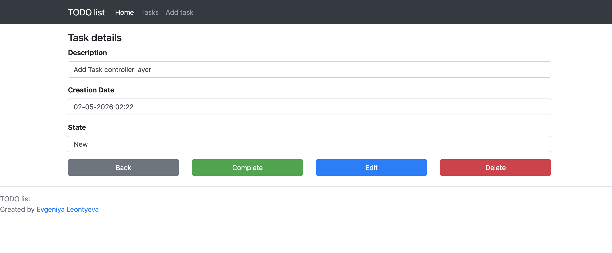
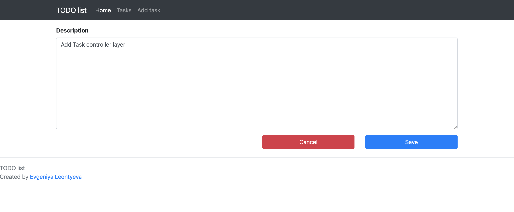

# Job4j Todo

Job4j Todo is a simple web application for managing tasks.

The application allows users to create tasks, view the full task list, filter tasks by status, edit task descriptions, mark tasks as completed, and delete tasks.

## Technologies

- Java 21
- Spring Boot
- Thymeleaf
- Bootstrap
- Hibernate
- PostgreSQL
- Liquibase
- Maven

## Features

- View all tasks
- View completed tasks
- View new tasks
- Create a new task
- Open task details
- Edit a task
- Mark a task as completed
- Delete a task

## Project structure

The application follows a three-layer architecture:

- Controller layer
- Service layer
- Persistence layer

Hibernate `SessionFactory` is created once as a Spring bean and reused in the persistence layer.

## Screenshots

### Task list

### Create task

### Task details

### Update task
